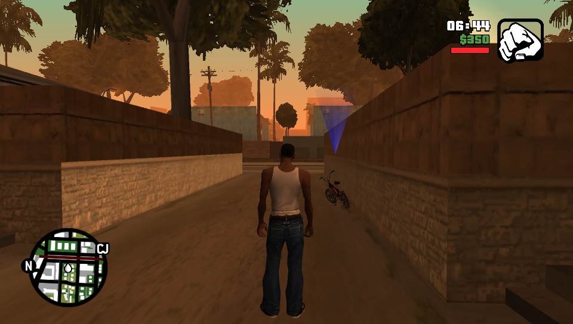
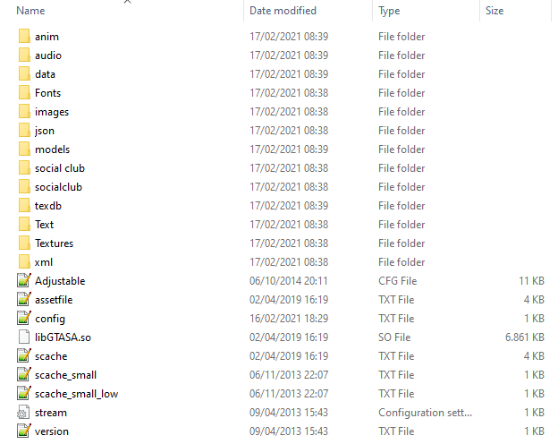
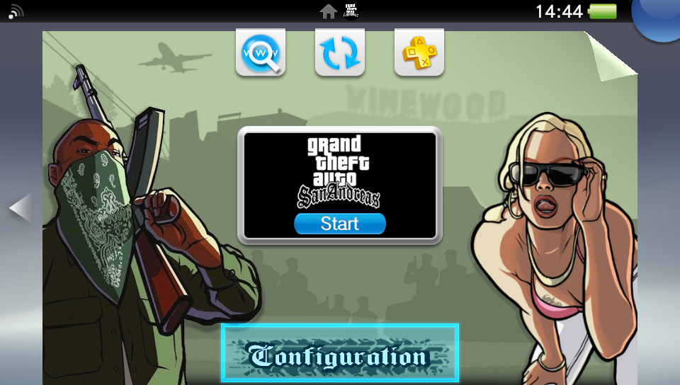

# Grand Theft Auto: San Andreas PS Vita Port

<p align="center"></p>

This is a wrapper/port of *Grand Theft Auto: San Andreas Android* for the *PS Vita* with lots of custom patches such as:

- Fixed camera controls for flying vehicles (including the Hydra jet).
- Fixed broken facial expressions.
- Fixed cheats hash key table.
- Removed specular lighting on pedestrians.
- Added PS2-like rendering.

The port works by loading the official Android ARMv7 executable in memory, resolving its imports with native functions and patching it in order to properly run.

## Setup Instructions (For End Users)

In order to properly install the game, you'll have to follow these steps precisely:
- Install [kubridge](https://github.com/TheOfficialFloW/kubridge/releases/) and [FdFix](https://github.com/TheOfficialFloW/FdFix/releases/) by copying `kubridge.skprx` and `fd_fix.skprx` to your taiHEN plugins folder (usually `ux0:tai`) and adding two entries to your `config.txt` under `*KERNEL`:
  
```
  *KERNEL
  ux0:tai/kubridge.skprx
  ux0:tai/fd_fix.skprx
```

**Note** Don't install fd_fix.skprx if you're using repatch plugin

- **Optional**: Install [PSVshell](https://github.com/Electry/PSVshell/releases) to overclock your device to 500Mhz.
- Install `libshacccg.suprx`, if you don't have it already, by following [this guide](https://samilops2.gitbook.io/vita-troubleshooting-guide/shader-compiler/extract-libshacccg.suprx).
- Obtain your copy of *Grand Theft Auto: San Andreas v2.00* legally (`com.rockstargames.gtasager` is not supported!) for Android in form of an `.apk` file and one or more `.obb` files (usually `main.8.com.rockstargames.gtasa.obb` and `patch.8.com.rockstargames.gtasa.obb` located inside the `/sdcard/android/obb/com.rockstargames.gtasa/`) folder. [You can get all the required files directly from your phone](https://stackoverflow.com/questions/11012976/how-do-i-get-the-apk-of-an-installed-app-without-root-access) or by using an apk extractor you can find in the play store.The apk can be extracted with whatever Zip extractor you prefer (eg: WinZip, WinRar, etc...) since apk is basically a zip file. You can rename `.apk` to `.zip` to open them with your default zip extractor.
- Open the apk with your zip explorer, extract the `assets` folder from your `.apk` file to `ux0:data` and rename it to `gtasa`. The result would be `ux0:data/gtasa/`
- Still in the apk, extract the file `libGTASA.so` from the `lib/armeabi-v7a` folder to `ux0:data/gtasa`. 
- Open the `main.8.com.rockstargames.gtasa.obb` with your zip explorer (`.obb` files are zip files just like `.apk` files so just rename the `.obb` to `.zip`) and extract the contents to `ux0:data/gtasa`.
- Same as before, open the `patch.8.com.rockstargames.gtasa.obb` with the zip explorer and extract the contents inside the zip to `ux0:data/gtasa`.
- Download the [gamefiles.zip](https://github.com/TheOfficialFloW/gtasa_vita/releases/download/v1.0/gamefiles.zip) and extract the contents to `ux0:data/gtasa` (if it ask about overwriting files, say yes).
- **Optional**: For a more authentic console experience, copy the file `ux0:data/gtasa/data/360Default1280x720.cfg` to `ux0:data/gtasa/` and rename it from `360Default1280x720.cfg` to `Adjustable.cfg`. This file is a leftover from the Xbox 360 version and provides you the console HUD (e.g. radar on bottom left).
- Install [GTASA.vpk](https://github.com/TheOfficialFloW/gtasa_vita/releases/download/v1.0/GTASA.vpk) on your *PS Vita*.

If you have followed the steps correctly, this is how your `ux0:data/gtasa` folder should look like.

<p align="center"></p>

## Configurator App

After fully installing the port, you'll be able to configure it with the Configurator app.  
The Configurator app will allow users to enable or disable a set of optimizations, patches and renderer alterations to best match users taste.  
You can launch the Configurator app by clicking on the `Configuration` button located on the LiveArea section of the port as shown in the following screenshot.

<p align="center"></p>

## Tips and Tricks

- In order to reduce occasional stutters in-game, delete both `ux0:data/gtasa/scache_small_low.txt` and `ux0:data/gtasa/scache_small.txt`, then create a copy of the `ux0:data/gtasa/scache.txt` file to have two version of it. (for example `scache(1).txt` so in the end you end up with both `scache.txt` and `scache(1).txt` inside the `ux0:data/gtasa/` folder), then rename `scache.txt` to `scache_small.txt` and `scache(1).txt` to `scache_small_low.txt` . This will however make the loading screen longer since it needs to compile more shaders ahead.
- You can input PC cheats by pressing L+SELECT to open the on-screen keyboard. See https://gtagmodding.com/sanandreas/cheats/ for the full list of cheats (you can input cheat codes in lowercase as well as uppercase). Note that a few cheats have been removed from the Android version.
- The L2/R2 buttons are mapped to the rear touchpad on the top and the L3/R3 buttons are mapped to the front touchpad on the bottom.

## Build Instructions (For Developers)

In order to build the loader, you'll need a [vitasdk](https://github.com/vitasdk) build fully compiled with softfp usage.  
You can find a precompiled version here: [Linux](https://github.com/vitasdk/buildscripts/suites/1824103476/artifacts/35161735) / [Windows](https://github.com/vitasdk/buildscripts/suites/1836262288/artifacts/35501612).  
Additionally, you'll need these libraries to bee compiled as well with `-mfloat-abi=softfp` added to their CFLAGS:

- [openal-soft](https://github.com/isage/openal-soft/tree/vita-1.19.1)
- [libmathneon](https://github.com/Rinnegatamante/math-neon)
- [vitaShaRK](https://github.com/Rinnegatamante/vitaShaRK)
- [imgui-vita](https://github.com/Rinnegatamante/imgui-vita)
- [kubridge](https://github.com/TheOfficialFloW/kubridge)

As last requirement, you'll need to compile [vitaGL](https://github.com/Rinnegatamante/vitaGL) with `make HAVE_SBRK=1 SOFTFP_ABI=1 SHARED_RENDERTARGETS=1 NO_DEBUG=1 install`.  
After all these requirements are met, you can compile the loader with the following commands:

```
mkdir build && cd build
cmake -G "Unix Makefiles" ..
make
```

## Credits

- Rinnegatamante for porting the renderer using vitaGL, providing the companion app and making various improvements to the port.
- aap for porting PS2-rendering aka skygfx.
- Freakler for providing LiveArea assets.
- frangarcj, fgsfds and Bythos for graphics-related stuff.
- CBPS/SonicMastr for PIB, which was used on earlier stages of development.
- isage for the native audio backend for OpenAL-Soft.

